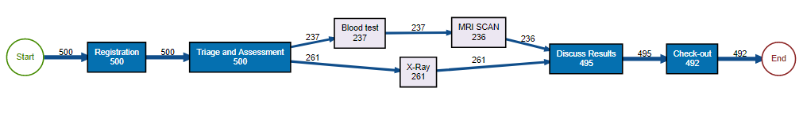
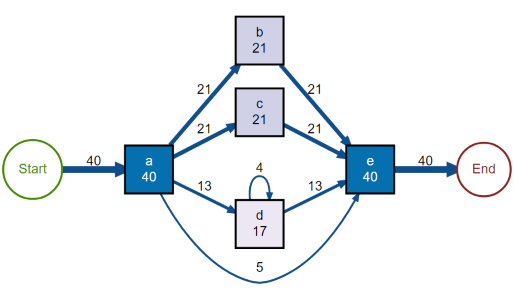
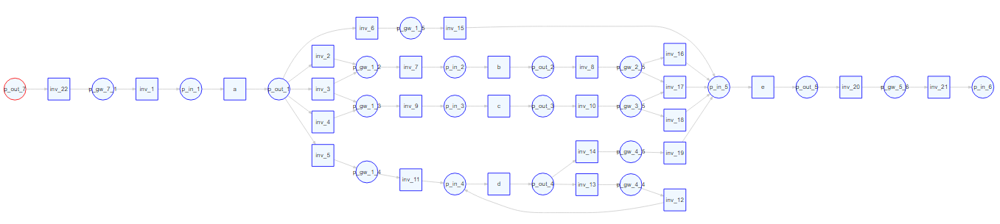

# Discover Process Models With the Heuristics Miner

Discovery of process models from event logs based on the Heuristics Miner algorithm integrated into the [bupaR](http://bupar.net/) framework.

## Installation

You can install the release CRAN version with:

``` r
install.packages("heuristicsmineR")
```

You can install the development version of heuristicsmineR with:

``` r
remotes::install_github("fmannhardt/heuristicsmineR")
```

## Example

This is a basic usage example discovering the Causal net of the `patients` event log:

``` r
library(heuristicsmineR)
library(eventdataR)
data(patients)

# Dependency graph / matrix
dependency_matrix(patients)
# Causal graph / Heuristics net
causal_net(patients)
```



This discovers the Causal net of the built-in `L_heur_1` event log that was proposed in the [Process Mining book](http://www.processmining.org/book/start):

``` r
# Efficient precedence matrix
m <- precedence_matrix_absolute(L_heur_1)
as.matrix(m)

# Example from Process mining book
dependency_matrix(L_heur_1, threshold = .7)
causal_net(L_heur_1, threshold = .7)
```



The Causal net can be converted to a Petri net (note that there are some uneccesary invisible transition that are not yet removed):

``` r
# Convert to Petri net
library(petrinetR)
cn <- causal_net(L_heur_1, threshold = .7)
pn <- as.petrinet(cn)
render_PN(pn)
```



The Petri net can be further used, for example for conformance checking through the [pm4py](https://github.com/fmannhardt/pm4py) package (Note that the final marking is currently not saved in petrinetR):

``` r
library(pm4py)
conformance_alignment(L_heur_1, pn, 
                      initial_marking = pn$marking, 
                      final_marking = c("p_in_6"))
```


